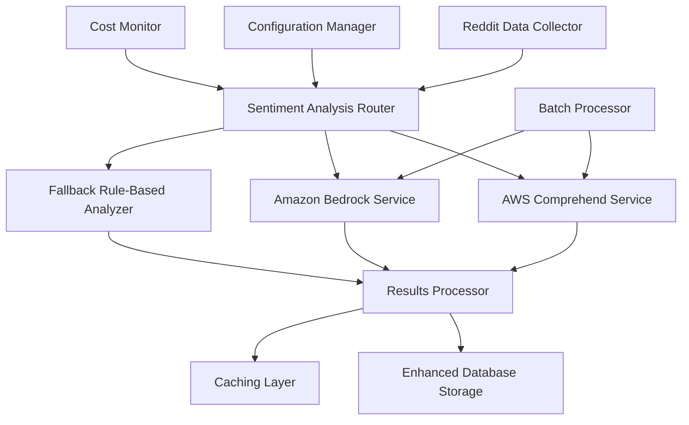

# AWS Sentiment Integration Design Document

## Overview

This design integrates AWS's advanced sentiment analysis capabilities into the existing Reddit data collector system. The solution uses Amazon Comprehend as the primary sentiment analysis engine with optional Amazon Bedrock integration for advanced insights. The design maintains backward compatibility while providing significantly enhanced sentiment analysis capabilities.

## Architecture

### High-Level Architecture



### Service Integration Flow

1. **Data Collection**: Existing Reddit collector captures posts/comments
2. **Sentiment Routing**: New router determines which analysis service to use
3. **AWS Processing**: Comprehend/Bedrock analyze text with intelligent batching
4. **Result Processing**: Standardize and enrich results from different services
5. **Storage**: Enhanced database schema stores comprehensive analysis results
6. **Caching**: Intelligent caching reduces duplicate API calls and costs

## Components and Interfaces

### 1. AWS Sentiment Service Manager

**Purpose**: Central coordinator for all AWS sentiment analysis operations

**Key Methods**:
```python
class AWSSentimentManager:
    def analyze_text(self, text: str, options: AnalysisOptions) -> SentimentResult
    def batch_analyze(self, texts: List[str], options: AnalysisOptions) -> List[SentimentResult]
    def get_cost_estimate(self, text_count: int, avg_length: int) -> CostEstimate
    def health_check(self) -> ServiceHealth
```

**Responsibilities**:
- Route requests to appropriate AWS services
- Handle authentication and region configuration
- Implement cost monitoring and rate limiting
- Coordinate batch processing for efficiency

### 2. Amazon Comprehend Integration

**Purpose**: Interface with AWS Comprehend for sentiment and emotion analysis

**Key Methods**:
```python
class ComprehendAnalyzer:
    def analyze_sentiment(self, text: str) -> ComprehendSentimentResult
    def detect_emotions(self, text: str) -> EmotionResult
    def batch_sentiment_analysis(self, texts: List[str]) -> List[ComprehendSentimentResult]
    def detect_key_phrases(self, text: str) -> KeyPhrasesResult
```

**Features**:
- Sentiment analysis with confidence scores
- Emotion detection (joy, anger, fear, sadness, surprise, disgust)
- Key phrase extraction for compensation-related terms
- Language detection and multi-language support

### 3. Amazon Bedrock Integration

**Purpose**: Advanced analysis using foundation models for deeper insights

**Key Methods**:
```python
class BedrockAnalyzer:
    def advanced_sentiment_analysis(self, text: str) -> BedrockInsights
    def extract_compensation_themes(self, text: str) -> ThemeAnalysis
    def analyze_employee_concerns(self, text: str) -> ConcernAnalysis
    def generate_summary_insights(self, texts: List[str]) -> SummaryInsights
```

**Capabilities**:
- Nuanced sentiment understanding beyond positive/negative
- Compensation-specific theme extraction
- Employee concern categorization
- Contextual understanding of workplace discussions

### 4. Intelligent Caching System

**Purpose**: Minimize AWS API costs through smart caching strategies

**Key Methods**:
```python
class SentimentCache:
    def get_cached_result(self, text_hash: str) -> Optional[CachedResult]
    def cache_result(self, text_hash: str, result: SentimentResult, ttl: int)
    def invalidate_expired_cache(self)
    def get_cache_stats(self) -> CacheStatistics
```

**Strategies**:
- Content-based hashing for duplicate detection
- TTL-based expiration for cost optimization
- LRU eviction for memory management
- Cache hit rate monitoring

### 5. Cost Monitoring and Control

**Purpose**: Track and control AWS service usage costs

**Key Methods**:
```python
class CostMonitor:
    def track_api_call(self, service: str, operation: str, cost: float)
    def get_current_usage(self) -> UsageReport
    def check_budget_limits(self) -> BudgetStatus
    def estimate_batch_cost(self, batch_size: int) -> float
```

**Features**:
- Real-time cost tracking
- Budget alerts and limits
- Usage forecasting
- Cost optimization recommendations

## Data Models

### Enhanced Sentiment Result Schema

```python
@dataclass
class EnhancedSentimentResult:
    # Basic sentiment
    sentiment: str  # POSITIVE, NEGATIVE, NEUTRAL, MIXED
    confidence: float
    
    # AWS Comprehend results
    comprehend_sentiment: Optional[ComprehendSentiment]
    emotions: Optional[List[Emotion]]
    key_phrases: Optional[List[KeyPhrase]]
    
    # Bedrock advanced insights
    bedrock_insights: Optional[BedrockInsights]
    themes: Optional[List[Theme]]
    concerns: Optional[List[Concern]]
    
    # Metadata
    analysis_timestamp: datetime
    service_used: str
    processing_time_ms: int
    cost_estimate: float
```

### Database Schema Extensions

```sql
-- Enhanced sentiment analysis results
CREATE TABLE sentiment_analysis_results (
    id SERIAL PRIMARY KEY,
    post_id VARCHAR(50),
    comment_id VARCHAR(50),
    
    -- Basic sentiment
    sentiment VARCHAR(20) NOT NULL,
    confidence DECIMAL(5,4),
    
    -- AWS Comprehend results
    comprehend_sentiment JSONB,
    emotions JSONB,
    key_phrases JSONB,
    
    -- Bedrock insights
    bedrock_insights JSONB,
    themes JSONB,
    concerns JSONB,
    
    -- Metadata
    analysis_timestamp TIMESTAMP DEFAULT NOW(),
    service_used VARCHAR(50),
    processing_time_ms INTEGER,
    cost_estimate DECIMAL(10,6),
    
    FOREIGN KEY (post_id) REFERENCES posts(id),
    FOREIGN KEY (comment_id) REFERENCES comments(id)
);

-- Cost tracking
CREATE TABLE aws_usage_tracking (
    id SERIAL PRIMARY KEY,
    service_name VARCHAR(50),
    operation VARCHAR(50),
    request_count INTEGER,
    total_cost DECIMAL(10,6),
    date DATE DEFAULT CURRENT_DATE
);
```

## Error Handling

### Error Categories and Responses

1. **AWS Service Unavailable**
   - Fallback to rule-based analyzer
   - Log service outage
   - Retry with exponential backoff

2. **Authentication/Authorization Errors**
   - Clear error messages for credential issues
   - Guidance for AWS setup
   - Graceful degradation to local analysis

3. **Rate Limiting**
   - Intelligent queuing system
   - Automatic backoff and retry
   - Cost-aware request spacing

4. **Text Processing Errors**
   - Handle oversized text with chunking
   - Character encoding issues
   - Language detection failures

### Fallback Strategy

```python
def analyze_with_fallback(text: str) -> SentimentResult:
    try:
        # Primary: AWS Comprehend
        return comprehend_analyzer.analyze(text)
    except AWSServiceError:
        try:
            # Secondary: Bedrock (if configured)
            return bedrock_analyzer.analyze(text)
        except AWSServiceError:
            # Fallback: Rule-based analyzer
            return rule_based_analyzer.analyze(text)
```

## Testing Strategy

### Unit Testing
- Mock AWS services for isolated testing
- Test error handling and fallback mechanisms
- Validate data model transformations
- Cost calculation accuracy

### Integration Testing
- End-to-end AWS service integration
- Database schema compatibility
- Performance under load
- Cost monitoring accuracy

### Performance Testing
- Batch processing efficiency
- Cache hit rate optimization
- Memory usage with large datasets
- API rate limit handling

### Cost Testing
- Actual AWS cost validation
- Budget limit enforcement
- Cost estimation accuracy
- Cache effectiveness measurement

## Configuration Management

### AWS Service Configuration

```python
@dataclass
class AWSConfig:
    # Authentication
    aws_access_key_id: str
    aws_secret_access_key: str
    aws_region: str = "us-east-1"
    
    # Service enablement
    enable_comprehend: bool = True
    enable_bedrock: bool = False
    enable_translate: bool = False
    
    # Cost controls
    daily_budget_limit: float = 50.0
    max_requests_per_minute: int = 100
    
    # Caching
    cache_ttl_hours: int = 24
    max_cache_size_mb: int = 100
    
    # Batching
    batch_size: int = 25
    batch_timeout_seconds: int = 30
```

### Environment Variables

```bash
# AWS Configuration
AWS_SENTIMENT_ENABLED=true
AWS_REGION=us-east-1
AWS_ACCESS_KEY_ID=your_key_here
AWS_SECRET_ACCESS_KEY=your_secret_here

# Service Configuration
ENABLE_COMPREHEND=true
ENABLE_BEDROCK=false
DAILY_BUDGET_LIMIT=50.0

# Performance Tuning
BATCH_SIZE=25
CACHE_TTL_HOURS=24
MAX_REQUESTS_PER_MINUTE=100
```

## Security Considerations

### AWS Credentials Management
- Support for IAM roles and temporary credentials
- Environment variable and AWS credentials file support
- Principle of least privilege for AWS permissions
- Credential rotation support

### Data Privacy
- No persistent storage of raw text in AWS
- Encryption in transit for all AWS communications
- Audit logging for all AWS API calls
- Compliance with data retention policies

### Required AWS Permissions

```json
{
    "Version": "2012-10-17",
    "Statement": [
        {
            "Effect": "Allow",
            "Action": [
                "comprehend:DetectSentiment",
                "comprehend:DetectEntities",
                "comprehend:DetectKeyPhrases",
                "comprehend:BatchDetectSentiment"
            ],
            "Resource": "*"
        },
        {
            "Effect": "Allow",
            "Action": [
                "bedrock:InvokeModel"
            ],
            "Resource": "arn:aws:bedrock:*:*:foundation-model/*"
        }
    ]
}
```

## Performance Optimization

### Batch Processing Strategy
- Group similar-length texts for optimal batching
- Parallel processing of independent batches
- Queue management for rate limit compliance
- Progress tracking for long-running batch jobs

### Caching Strategy
- Content-based deduplication
- Intelligent cache warming for common patterns
- Memory-efficient storage of results
- Cache analytics for optimization

### Cost Optimization
- Intelligent service selection based on text complexity
- Bulk processing discounts utilization
- Regional optimization for reduced latency costs
- Usage pattern analysis for budget planning